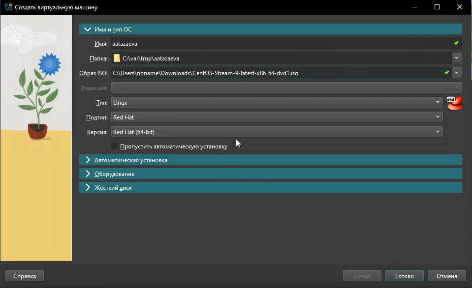
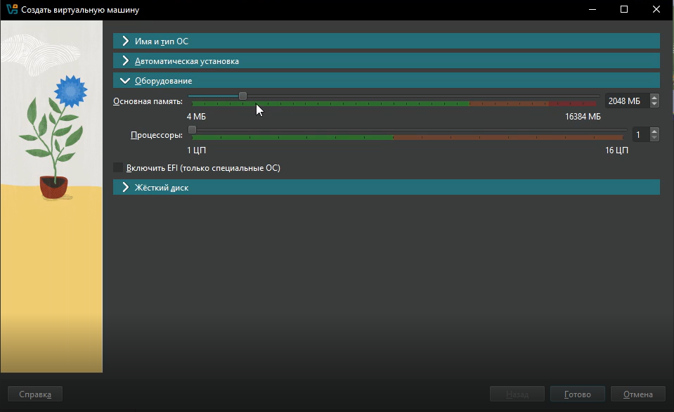
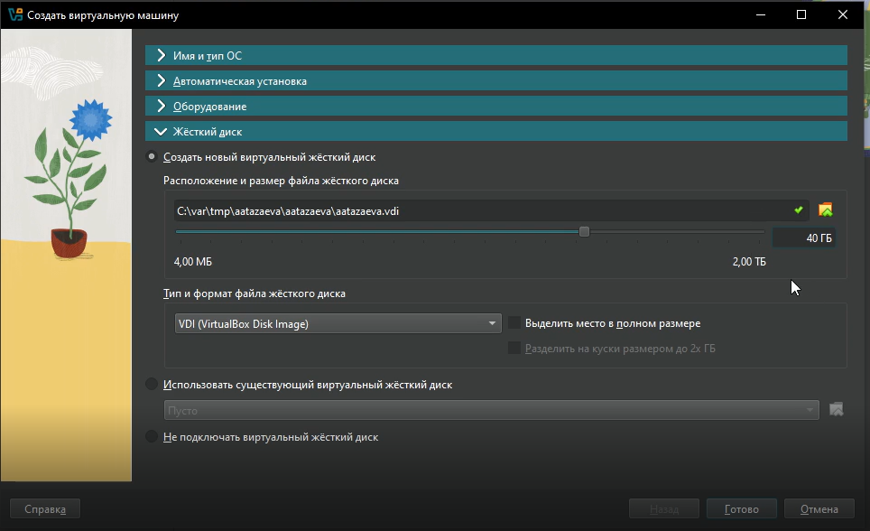
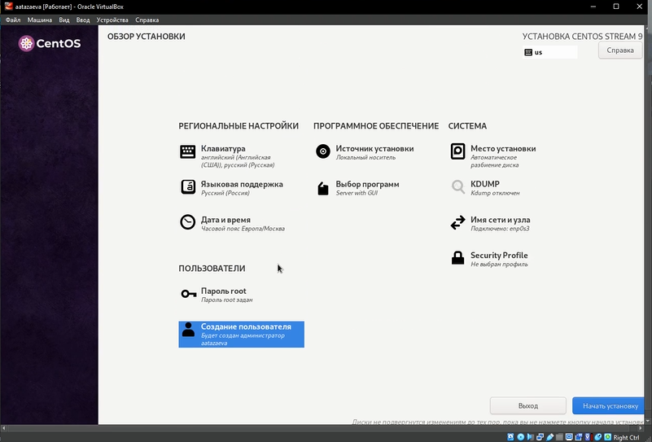
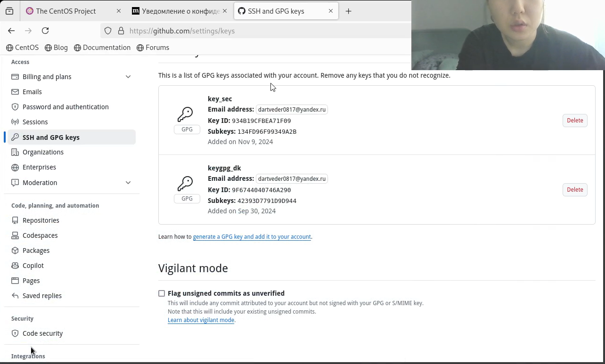
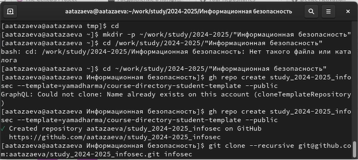
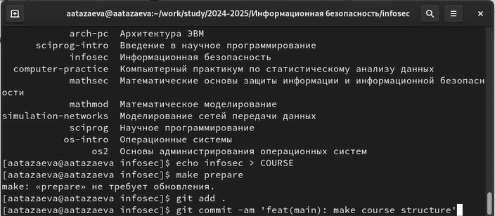

---
## Front matter
lang: ru-RU
title: Лабораторная работа №1
subtitle: Установка и конфигурация операционной системы на виртуальную машину
author:
  - Тазаева А. А.
institute:
  - Российский университет дружбы народов, Москва, Россия

## i18n babel
babel-lang: russian
babel-otherlangs: english

## Formatting pdf
toc: false
toc-title: Содержание
slide_level: 2
aspectratio: 169
section-titles: true
theme: metropolis
header-includes:
 - \metroset{progressbar=frametitle,sectionpage=progressbar,numbering=fraction}
---

# Цели и задачи работы

Целью данной работы является установка операционной системы на виртуальную машину, а также ее настройка.

## Результаты

{#fig:002 width=60% height=60% }

## Результаты

{#fig:003 width=60% height=60% }

## Результаты

{#fig:004 width=60% height=60% }

## Результаты

{#fig:009 width=70%}

## Результаты

{#fig:011 width=70%}

## Результаты

{#fig:012 width=70%}

## Результаты

{#fig:013 width=70%}

# Выводы по проделанной работе

В ходе выполнения лабораторной работы была установлена операционная система Linux на VirtualBox

