---
## Front matter
title: "Лабораторная работа №1"
subtitle: "Установка и конфигурация операционной системы на виртуальную машину"
author: "Тазаева Анастасия Анатольевна"

## Generic otions
lang: ru-RU
toc-title: "Содержание"

## Bibliography
bibliography: bib/cite.bib
csl: pandoc/csl/gost-r-7-0-5-2008-numeric.csl

## Pdf output format
toc: true # Table of contents
toc-depth: 2
lof: true # List of figures
lot: true # List of tables
fontsize: 12pt
linestretch: 1.5
papersize: a4
documentclass: scrreprt
## I18n polyglossia
polyglossia-lang:
  name: russian
  options:
	- spelling=modern
	- babelshorthands=true
polyglossia-otherlangs:
  name: english
## I18n babel
babel-lang: russian
babel-otherlangs: english
## Fonts
mainfont: IBM Plex Serif
romanfont: IBM Plex Serif
sansfont: IBM Plex Sans
monofont: IBM Plex Mono
mathfont: STIX Two Math
mainfontoptions: Ligatures=Common,Ligatures=TeX,Scale=0.94
romanfontoptions: Ligatures=Common,Ligatures=TeX,Scale=0.94
sansfontoptions: Ligatures=Common,Ligatures=TeX,Scale=MatchLowercase,Scale=0.94
monofontoptions: Scale=MatchLowercase,Scale=0.94,FakeStretch=0.9
mathfontoptions:
## Biblatex
biblatex: true
biblio-style: "gost-numeric"
biblatexoptions:
  - parentracker=true
  - backend=biber
  - hyperref=auto
  - language=auto
  - autolang=other*
  - citestyle=gost-numeric
## Pandoc-crossref LaTeX customization
figureTitle: "Рис."
tableTitle: "Таблица"
listingTitle: "Листинг"
lofTitle: "Список иллюстраций"
lotTitle: "Список таблиц"
lolTitle: "Листинги"
## Misc options
indent: true
header-includes:
  - \usepackage{indentfirst}
  - \usepackage{float} # keep figures where there are in the text
  - \floatplacement{figure}{H} # keep figures where there are in the text
---

# Цель работы

Целью данной работы является установка операционной системы на виртуальную машину, а также ее настройка.

# Задание

Установить и сконфигурировать операционную систему на виртуальной машине.

# Выполнение лабораторной работы

Создала новую виртуальную машину (рис.1). Для этого в VirtualBox выбрала "Машина">"Создать".
Необходимо было ввести имя для новой виртуальной машины и её операционную систему (рис.2). Имя - aatazaeva. Образ ISO - Centos 9 (x86_64). Тип ОС - Linux. Подтип - Red Hat. Версия - 64-bit.
Далее выделила под оперативную память 2048 МБ (рис.3). Для виртуального жёсткого диска выделила 40 Гб (рис.4). 

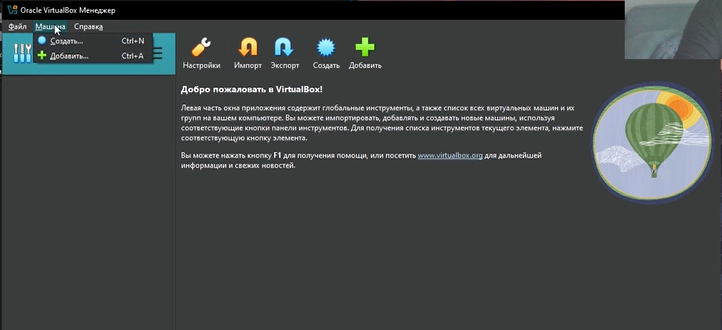{#fig:001 width=70%}
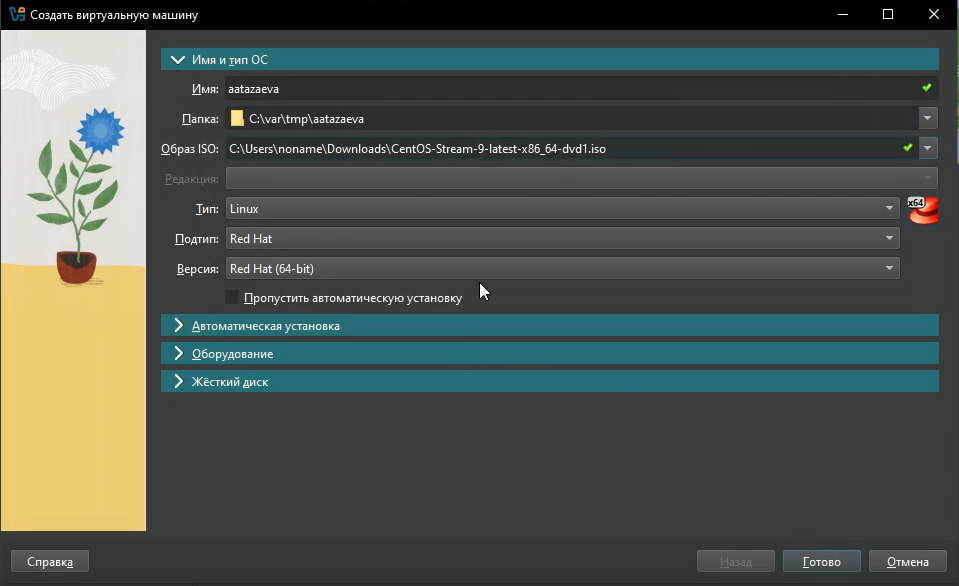{#fig:002 width=70%}
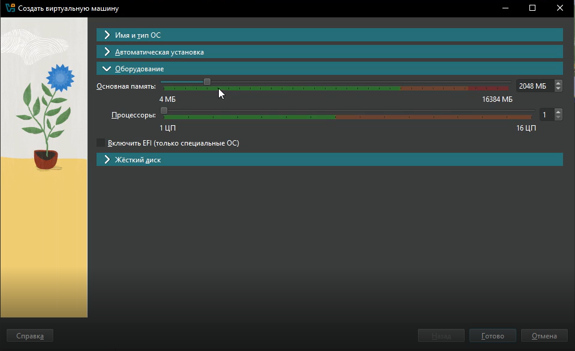{#fig:003 width=70%}
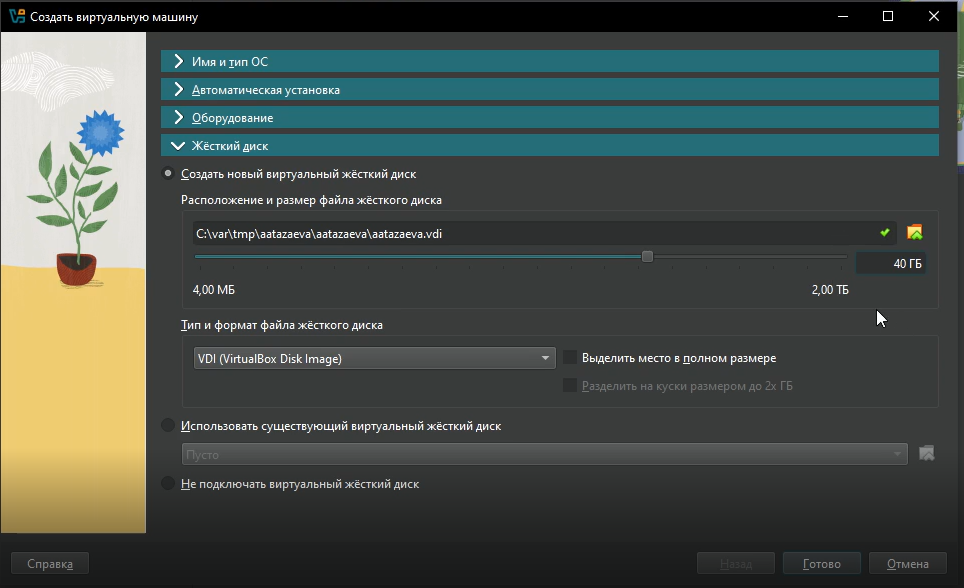{#fig:004 width=70%}

Установила привод оптического диска (рис.5). Выбрала ранее скачанный iso файл.

{#fig:001 width=70%}

Теперь можно запустить виртуальную машину. После ожидания загрузки, нам предложили выбрать язык интерфейса, выбрала Русский (рис. 6). Раскладки клавиатуры - английский (США), русский (Русский). Дата и время - часовой пояс Европа/Москва. В выборе программ выбрала базовое окружение Server with GUI, а дополнительное ПО Development Tools (рис. 7). Место установки - по стандарту (автоматически). KDUMP отключила. Сеть и интернет - указала имя узла aatazaeva.localdomain (рис. 8). На рис. 9 можно просмотреть выбранные настройки.

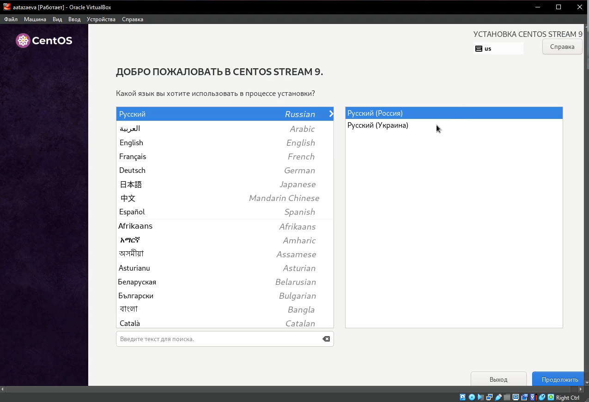{#fig:006 width=70%}
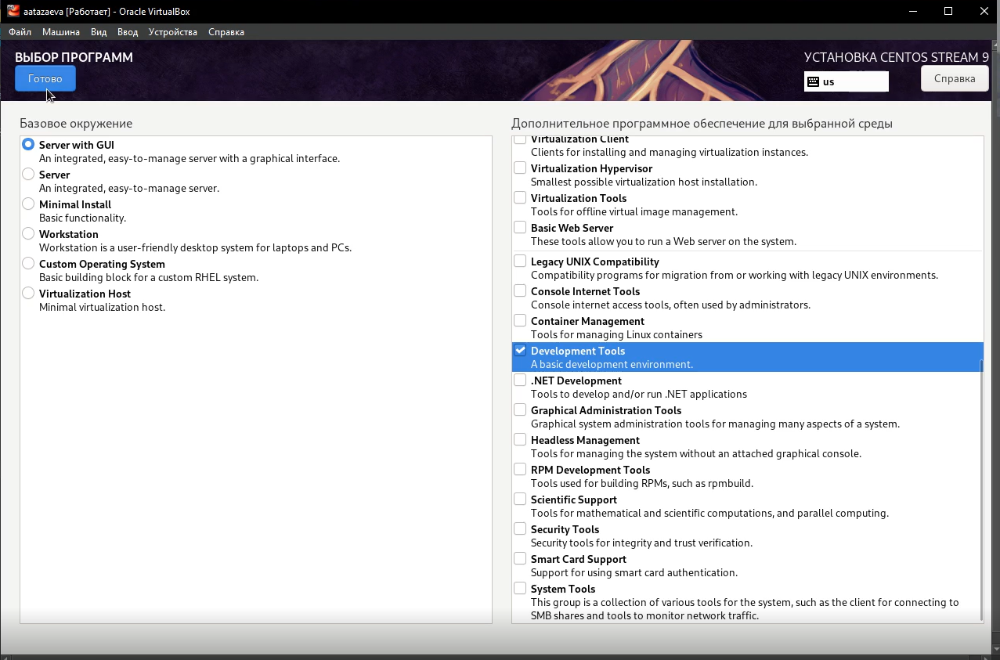{#fig:007 width=70%}
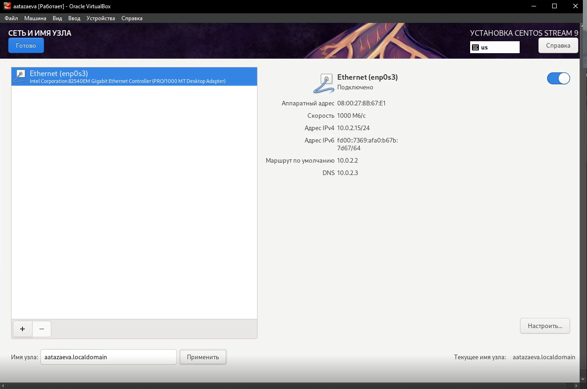{#fig:008 width=70%}
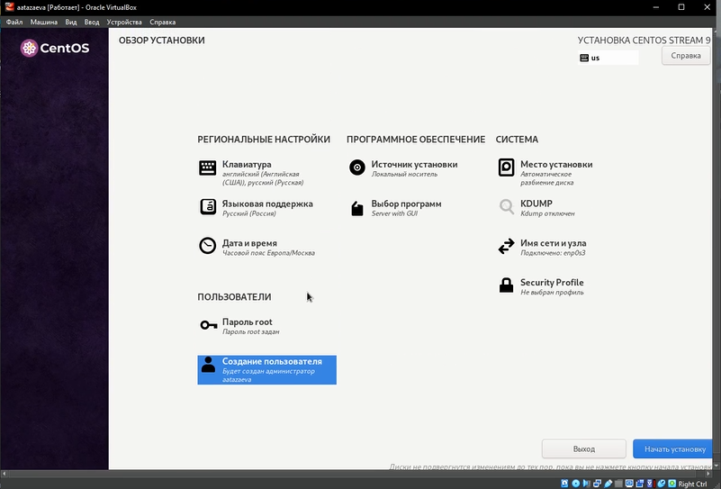{#fig:009 width=70%}

Далее указала пароль для суперпользователя. Создала пользователя с правами администратора, задала ему пароль (рис. 10). Далее нажала "начать установку".

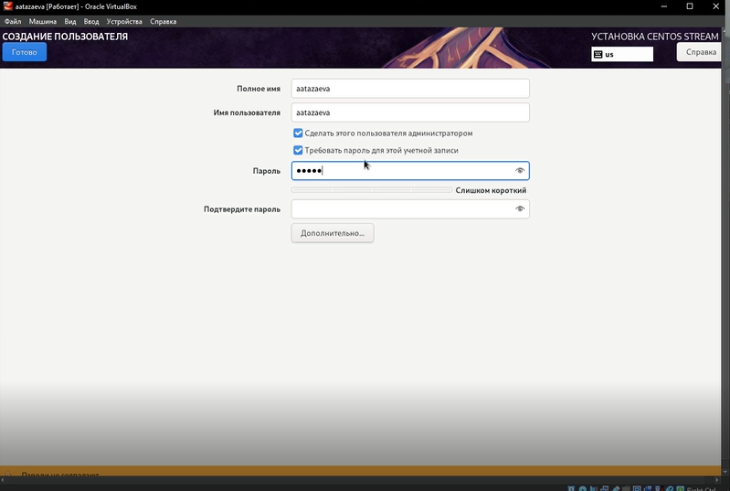{#fig:010 width=70%}

После успешной установки необходимо перезагрузить ОС. Теперь нам необходимо создать директорию с лабораторными работами.

Для этого создала ключ PGP и добавила его в ключи на github (рис. 11). Далее создала репозиторий курса на основе шаблона (рис.12). И настроила каталог курса (рис. 13).

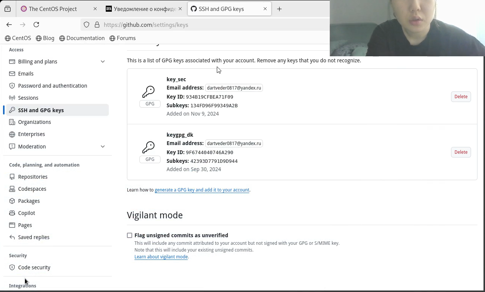{#fig:011 width=70%}
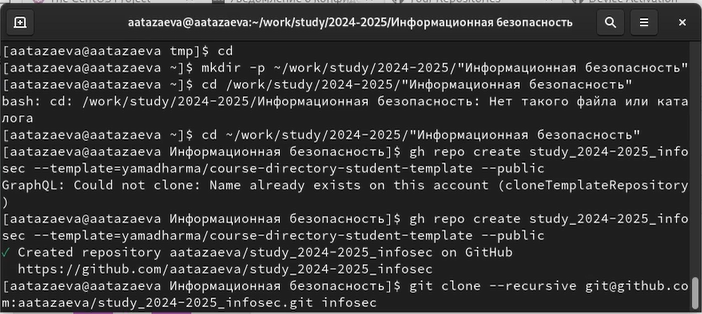{#fig:012 width=70%}
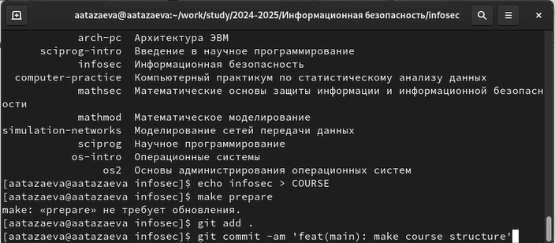{#fig:013 width=70%}
# Выводы

Я успешла установила операционную систему на виртуальную машину, а также ее настроила.

