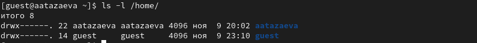
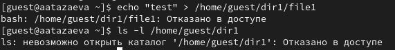

---
## Front matter
title: "Лабораторная работа №2"
subtitle: "Дискреционное разграничение прав в Linux. Основные атрибуты"
author: "Тазаева Анастасия Анатольевна"

## Generic otions
lang: ru-RU
toc-title: "Содержание"

## Bibliography
bibliography: bib/cite.bib
csl: pandoc/csl/gost-r-7-0-5-2008-numeric.csl

## Pdf output format
toc: true # Table of contents
toc-depth: 2
lof: true # List of figures
lot: true # List of tables
fontsize: 12pt
linestretch: 1.5
papersize: a4
documentclass: scrreprt
## I18n polyglossia
polyglossia-lang:
  name: russian
  options:
	- spelling=modern
	- babelshorthands=true
polyglossia-otherlangs:
  name: english
## I18n babel
babel-lang: russian
babel-otherlangs: english
## Fonts
mainfont: IBM Plex Serif
romanfont: IBM Plex Serif
sansfont: IBM Plex Sans
monofont: IBM Plex Mono
mathfont: STIX Two Math
mainfontoptions: Ligatures=Common,Ligatures=TeX,Scale=0.94
romanfontoptions: Ligatures=Common,Ligatures=TeX,Scale=0.94
sansfontoptions: Ligatures=Common,Ligatures=TeX,Scale=MatchLowercase,Scale=0.94
monofontoptions: Scale=MatchLowercase,Scale=0.94,FakeStretch=0.9
mathfontoptions:
## Biblatex
biblatex: true
biblio-style: "gost-numeric"
biblatexoptions:
  - parentracker=true
  - backend=biber
  - hyperref=auto
  - language=auto
  - autolang=other*
  - citestyle=gost-numeric
## Pandoc-crossref LaTeX customization
figureTitle: "Рис."
tableTitle: "Таблица"
listingTitle: "Листинг"
lofTitle: "Список иллюстраций"
lotTitle: "Список таблиц"
lolTitle: "Листинги"
## Misc options
indent: true
header-includes:
  - \usepackage{indentfirst}
  - \usepackage{float} # keep figures where there are in the text
  - \floatplacement{figure}{H} # keep figures where there are in the text
---

# Цель работы

Получение практических навыков работы в консоли с атрибутами файлов, закрепление теоретических основ дискреционного разграничения доступа в современных системах с открытым кодом на базе ОС Linux.

# Выполнение лабораторной работы

1. Создала учётную запись пользователя guest (рис. 1), добавив команду **sudo**, далее с помощью команды **su -** зашла в режим суперпользователя. 

{#fig:001 width=70%}

2. Задала пароль для пользователя guest с помощью команды **passwd guest** (рис. 2), пароль необходимо было ввести дважды для проверки.

{#fig:002 width=70%}

3. Вошла в систему от имени пользователя guest (рис. 3).

{#fig:003 width=70%}

4. С помощью команды **pwd** определила в какой директории нахожусь (рис. 4). Приглашение командной строки **guest@aatazaeva** совпадает с директорией, в которой нахожусь. С помощью команды **echo $HOME** узнала домашнюю директорию. Она совпадает с нынешним местонахождением пользователя.

{#fig:004 width=70%}

5. Уточнила имя пользователя командой **whoami** (рис. 5).

{#fig:005 width=70%}

6. Использовала команду **id**, получила uid, gid, группы куда входит пользователь (рис. 6). 

{#fig:006 width=70%}

7. Информация об имени пользователя совпадает с данными, выводимыми в приглашении командной строки (рис. 7). 

{#fig:007 width=70%}

8. Просмотрела файл /etc/passwd с помощью команды **cat /etc/passwd**, учетную запись выделила цветом (рис. 8). 

{#fig:008 width=70%}

9. Определила существующие в системе директории с помощью команды **ls -l /home** (рис. 9). Получила список поддиректорий. Для директориии aatazaeva установлены права на чтение запись и выполнение для владельца, аналогично и для второго пользователя.

{#fig:009 width=70%}

10. С помощью команды **lsattr /home** попыталась проверить расширенные атрибуты директорий, для директории пользователя имеющего права администратора в праве было отказано, для гостя можно увидеть на рис. 10.

{#fig:010 width=70%}

11.Создала в домашней директории поддиректорию dir1 и просмотрела какие права доступа были выделены для директории (рис. 11). 

{#fig:011 width=70%}

12. Сняла с новой директории все атрибуты командой **chmod 000 dir1** и проверила её правильность (рис. 12). 

{#fig:012 width=70%}

13. Попыталась создать файл и изменить его командой **echo "test" > /home/guest/dir1/file1** (рис. 12). Нам было отказано в доступе, что вполне логично, поскольку мы сняли права все права в пункте выше.

{#fig:013 width=70%}

14. Заполнила таблицу (@tbl:rules) .   

1- Создание файла

2- Удаление файла

3- Запись в файл

4- Чтение файла

5- Смена директории

6- Просмотр файлов в директории

7- Переименование файла

8- Смена атрибутов файла


: Установленные права и разрешённые действия {#tbl:rules}

|Права директории|Права файла|1|2|3|4|5|6|7|8|
|:---|:---|---|---|---|---|---|---|---|---|
|```d---------(000)```|```----------(000)```|-|-|-|-|-|-|-|-|
|```d--x------(100)```|```----------(000)```|-|-|-|-|+|-|-|+|
|```d-w-------(200)```|```----------(000)```|-|-|-|-|-|-|-|-|
|```d-wx------(300)```|```----------(000)```|+|+|-|-|+|-|+|+|
|```dr--------(400)```|```----------(000)```|-|-|-|-|-|-|-|-|
|```dr-x------(500)```|```----------(000)```|-|-|-|-|+|+|-|+|
|```drw-------(600)```|```----------(000)```|-|-|-|-|-|-|-|-|
|```drwx------(700)```|```----------(000)```|+|+|-|-|+|+|+|+|
|```d---------(000)```|```---x------(100)```|-|-|-|-|-|-|-|-|
|```d--x------(100)```|```---x------(100)```|-|-|-|-|+|-|-|+|
|```d-w-------(200)```|```---x------(100)```|-|-|-|-|-|-|-|-|
|```d-wx------(300)```|```---x------(100)```|+|+|-|-|+|-|+|+|
|```dr--------(400)```|```---x------(100)```|-|-|-|-|-|-|-|-|
|```dr-x------(500)```|```---x------(100)```|-|-|-|-|+|+|-|+|
|```drw-------(600)```|```---x------(100)```|-|-|-|-|-|-|-|-|
|```drwx------(700)```|```---x------(100)```|+|+|-|-|+|+|+|+|
|```d---------(000)```|```--w-------(200)```|-|-|-|-|-|-|-|-|
|```d--x------(100)```|```--w-------(200)```|-|-|+|-|+|-|-|+|
|```d-w-------(200)```|```--w-------(200)```|-|-|-|-|-|-|-|-|
|```d-wx------(300)```|```--w-------(200)```|+|+|+|-|+|-|+|+|
|```dr--------(400)```|```--w-------(200)```|-|-|-|-|-|-|-|-|
|```dr-x------(500)```|```--w-------(200)```|-|-|+|-|+|+|-|+|
|```drw-------(600)```|```--w-------(200)```|-|-|-|-|-|-|-|-|
|```drwx------(700)```|```--w-------(200)```|+|+|+|-|+|+|+|+|
|```d---------(000)```|```--wx------(300)```|-|-|-|-|-|-|-|-|
|```d--x------(100)```|```--wx------(300)```|-|-|+|-|+|-|-|+|
|```d-w-------(200)```|```--wx------(300)```|-|-|-|-|-|-|-|-|
|```d-wx------(300)```|```--wx------(300)```|+|+|+|-|+|-|+|+|
|```dr--------(400)```|```--wx------(300)```|-|-|-|-|-|-|-|-|
|```dr-x------(500)```|```--wx------(300)```|-|-|+|-|+|+|-|+|
|```drw-------(600)```|```--wx------(300)```|-|-|-|-|-|-|-|-|
|```drwx------(700)```|```--wx------(300)```|+|+|+|-|+|+|+|+|
|```d---------(000)```|```-r--------(400)```|-|-|-|-|-|-|-|-|
|```d--x------(100)```|```-r--------(400)```|-|-|-|+|+|-|-|+|
|```d-w-------(200)```|```-r--------(400)```|-|-|-|-|-|-|-|-|
|```d-wx------(300)```|```-r--------(400)```|+|+|-|+|+|-|+|+|
|```dr--------(400)```|```-r--------(400)```|-|-|-|-|-|-|-|-|
|```dr-x------(500)```|```-r--------(400)```|-|-|-|+|+|+|-|+|
|```drw-------(600)```|```-r--------(400)```|-|-|-|-|-|-|-|-|
|```drwx------(700)```|```-r--------(400)```|+|+|-|+|+|+|+|+|
|```d---------(000)```|```-r-x------(500)```|-|-|-|-|-|-|-|-|
|```d--x------(100)```|```-r-x------(500)```|-|-|-|+|+|-|-|+|
|```d-w-------(200)```|```-r-x------(500)```|-|-|-|-|-|-|-|-|
|```d-wx------(300)```|```-r-x------(500)```|+|+|-|+|+|-|+|+|
|```dr--------(400)```|```-r-x------(500)```|-|-|-|-|-|-|-|-|
|```dr-x------(500)```|```-r-x------(500)```|-|-|-|+|+|+|-|+|
|```drw-------(600)```|```-r-x------(500)```|-|-|-|-|-|-|-|-|
|```drwx------(700)```|```-r-x------(500)```|+|+|-|+|+|+|+|+|
|```d---------(000)```|```-rw-------(600)```|-|-|-|-|-|-|-|-|
|```d--x------(100)```|```-rw-------(600)```|-|-|+|+|+|-|-|+|
|```d-w-------(200)```|```-rw-------(600)```|-|-|-|-|-|-|-|-|
|```d-wx------(300)```|```-rw-------(600)```|+|+|+|+|+|-|+|+|
|```dr--------(400)```|```-rw-------(600)```|-|-|-|-|-|-|-|-|
|```dr-x------(500)```|```-rw-------(600)```|-|-|+|+|+|+|-|+|
|```drw-------(600)```|```-rw-------(600)```|-|-|-|-|-|-|-|-|
|```drwx------(700)```|```-rw-------(600)```|+|+|+|+|+|+|+|+|
|```d---------(000)```|```-rwx------(700)```|-|-|-|-|-|-|-|-|
|```d--x------(100)```|```-rwx------(700)```|-|-|+|+|+|-|-|+|
|```d-w-------(200)```|```-rwx------(700)```|-|-|-|-|-|-|-|-|
|```d-wx------(300)```|```-rwx------(700)```|+|+|+|+|+|-|+|+|
|```dr--------(400)```|```-rwx------(700)```|-|-|-|-|-|-|-|-|
|```dr-x------(500)```|```-rwx------(700)```|-|-|+|+|+|+|-|+|
|```drw-------(600)```|```-rwx------(700)```|-|-|-|-|-|-|-|-|
|```drwx------(700)```|```-rwx------(700)```|+|+|+|+|+|+|+|+|


15. На основании таблицы выше определила минимально необходимые права для выполнения операций внутри директории dir1 и заполнила таблицу @tbl:min-rig .
 
: Минимальные права для совершения операций {#tbl:min-rig}

|Операция|Права на директорию|Права на файл|
|:---:|:---:|:---:|
|Создание файла|```d-wx------ (300)```|```---------- (000)```|	    
|Удаление файла|```d-wx------ (300)```|```---------- (000)```|
|Чтение файла|```d--x------ (100)```|```-r-------- (400)```|
|Запись в файл|```d--x------ (100)```|```--w------- (200)```|
|Переименование файла|```d-wx------ (300)```|```----------(000)```|
|Создание поддиректории|```d-wx------ (300)```|```---------- (000)```|
|Удаление поддиректории|```d-wx------ (300)```|```---------- (000)```|


# Выводы

Мною были получены практические навыки работы в консоли с атрибутами файлов.


