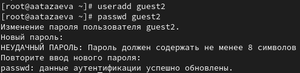
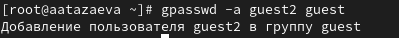
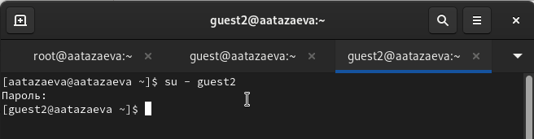
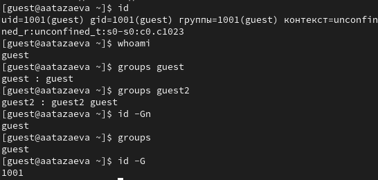
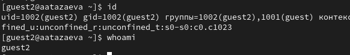
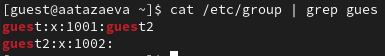
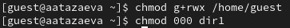

---
## Front matter
title: "Лабораторная работа №3"
subtitle: "Дискреционное разграничение прав в Linux. Два пользователя"
author: "Тазаева Анастасия Анатольевна"

## Generic otions
lang: ru-RU
toc-title: "Содержание"

## Bibliography
bibliography: bib/cite.bib
csl: pandoc/csl/gost-r-7-0-5-2008-numeric.csl

## Pdf output format
toc: true # Table of contents
toc-depth: 2
lof: true # List of figures
lot: true # List of tables
fontsize: 12pt
linestretch: 1.5
papersize: a4
documentclass: scrreprt
## I18n polyglossia
polyglossia-lang:
  name: russian
  options:
	- spelling=modern
	- babelshorthands=true
polyglossia-otherlangs:
  name: english
## I18n babel
babel-lang: russian
babel-otherlangs: english
## Fonts
mainfont: IBM Plex Serif
romanfont: IBM Plex Serif
sansfont: IBM Plex Sans
monofont: IBM Plex Mono
mathfont: STIX Two Math
mainfontoptions: Ligatures=Common,Ligatures=TeX,Scale=0.94
romanfontoptions: Ligatures=Common,Ligatures=TeX,Scale=0.94
sansfontoptions: Ligatures=Common,Ligatures=TeX,Scale=MatchLowercase,Scale=0.94
monofontoptions: Scale=MatchLowercase,Scale=0.94,FakeStretch=0.9
mathfontoptions:
## Biblatex
biblatex: true
biblio-style: "gost-numeric"
biblatexoptions:
  - parentracker=true
  - backend=biber
  - hyperref=auto
  - language=auto
  - autolang=other*
  - citestyle=gost-numeric
## Pandoc-crossref LaTeX customization
figureTitle: "Рис."
tableTitle: "Таблица"
listingTitle: "Листинг"
lofTitle: "Список иллюстраций"
lotTitle: "Список таблиц"
lolTitle: "Листинги"
## Misc options
indent: true
header-includes:
  - \usepackage{indentfirst}
  - \usepackage{float} # keep figures where there are in the text
  - \floatplacement{figure}{H} # keep figures where there are in the text
---

# Цель работы

Получение практических навыков работы в консоли с атрибутами файлов для групп пользователей.

# Выполнение лабораторной работы

1. В прошлой лабораторной работе уже был установлен пользователь guest.

2. А также ему был задан пароль.

3. Аналогично создали второго пользователя и указали ему пароль (рис. 1).

{#fig:001 width=70%}

4. С помощью команды **gpasswd -a guest2 guest** добавили пользователя guest2 в группу guest (рис. 2).

{#fig:002 width=70%}

5. В терминале осуществили вход в систему от двух пользователей (рис. 3).

{#fig:003 width=70%}

6. Для обоих пользователей командой **pwd** определили директорию, в которой находится каждый пользователь(рис. 4 и 5). Она совпадает с приглашениями командной строки соответсвующего пользователя.

{#fig:004 width=70%}
{#fig:005 width=70%}

7. С помощью команды **id** определили uis, gid и группы, к которым принадлежат пользователи (рис. 6 и 7).. С помощью команды **whoami** уточнили имя каждого пользователя. Командами **groups guest** и **groups guest2** определили, в какие группы входят соответствующие пользователи. Команда **id -Gn** выводит список групп для пользователя, а **id -G** - айди группы пользователя. 

{#fig:006 width=70%}
{#fig:007 width=70%}

8. Просмотрели  файл /etc/group, появилась группа guest2 (рис. 8).

{#fig:008 width=70%}

9. От имени пользователя guest2 выполнили регистрацию пользователя guest2 в группе guest командой **newgrp guest** (рис. 9).

{#fig:009 width=70%}

10. От имени пользователя guest изменили права директории /home/guest, разрешив все действия для пользователей группы (рис. 10). А на директорию права сняли.

{#fig:010 width=70%}

11. Заполнила таблицу (@tbl:rules) .   

1- Создание файла

2- Удаление файла

3- Запись в файл

4- Чтение файла

5- Смена директории

6- Просмотр файлов в директории

7- Переименование файла

8- Смена атрибутов файла


|Права директории|Права файла|1|2|3|4|5|6|7|8|
|------------------|-------------|-------|-----|------|-------|------------|-----------|---------|------------|
|```---------``` (000)|```---------``` (000)| - | - | - | - | - | - | - | - |
|```---------``` (000)|```-----x---``` (010)| - | - | - | - | - | - | - | - |
|```---------``` (000)|```----w----``` (020)| - | - | - | - | - | - | - | - |
|```---------``` (000)|```----wx---``` (030)| - | - | - | - | - | - | - | - |
|```---------``` (000)|```---r-----``` (040)| - | - | - | - | - | - | - | - |
|```---------``` (000)|```---r-x---``` (050)| - | - | - | - | - | - | - | - |
|```---------``` (000)|```---rw----``` (060)| - | - | - | - | - | - | - | - |
|```---------``` (000)|```---rwx---``` (070)| - | - | - | - | - | - | - | - |
|```-----x---``` (010)|```---------``` (000)| - | - | - | - | + | - | - | - |
|```-----x---``` (010)|```-----x---``` (010)| - | - | - | - | + | - | - | - |
|```-----x---``` (010)|```----w----``` (020)| - | - | + | - | + | - | - | - |
|```-----x---``` (010)|```----wx---``` (030)| - | - | + | - | + | - | - | - |
|```-----x---``` (010)|```---r-----``` (040)| - | - | - | + | + | - | - | + |
|```-----x---``` (010)|```---r-x---``` (050)| - | - | - | + | + | - | - | + |
|```-----x---``` (010)|```---rw----``` (060)| - | - | + | + | + | - | - | + |
|```-----x---``` (010)|```---rwx---``` (070)| - | - | + | + | + | - | - | + |
|```----w----``` (020)|```---------``` (000)| - | - | - | - | - | - | - | - |
|```----w----``` (020)|```-----x---``` (010)| - | - | - | - | - | - | - | - |
|```----w----``` (020)|```----w----``` (020)| - | - | - | - | - | - | - | - |
|```----w----``` (020)|```----wx---``` (030)| - | - | - | - | - | - | - | - |
|```----w----``` (020)|```---r-----``` (040)| - | - | - | - | - | - | - | - |
|```----w----``` (020)|```---r-x---``` (050)| - | - | - | - | - | - | - | - |
|```----w----``` (020)|```---rw----``` (060)| - | - | - | - | - | - | - | - |
|```----w----``` (020)|```---rwx---``` (070)| - | - | - | - | - | - | - | - |
|```----wx---``` (030)|```---------``` (000)| + | + | - | - | + | - | + | - |
|```----wx---``` (030)|```-----x---``` (010)| + | + | - | - | + | - | + | - |
|```----wx---``` (030)|```----w----``` (020)| + | + | + | - | + | - | + | - |
|```----wx---``` (030)|```----wx---``` (030)| + | + | + | - | + | - | + | - |
|```----wx---``` (030)|```---r-----``` (040)| + | + | - | + | + | - | + | + |
|```----wx---``` (030)|```---r-x---``` (050)| + | + | - | + | + | - | + | + |
|```----wx---``` (030)|```---rw----``` (060)| + | + | + | + | + | - | + | + |
|```----wx---``` (030)|```---rwx---``` (070)| + | + | + | + | + | - | + | + |
|```---r-----``` (040)|```---------``` (000)| - | - | - | - | - | + | - | - |
|```---r-----``` (040)|```-----x---``` (010)| - | - | - | - | - | + | - | - |
|```---r-----``` (040)|```----w----``` (020)| - | - | - | - | - | + | - | - |
|```---r-----``` (040)|```----wx---``` (030)| - | - | - | - | - | + | - | - |
|```---r-----``` (040)|```---r-----``` (040)| - | - | - | - | - | + | - | - |
|```---r-----``` (040)|```---r-x---``` (050)| - | - | - | - | - | + | - | - |
|```---r-----``` (040)|```---rw----``` (060)| - | - | - | - | - | + | - | - |
|```---r-----``` (040)|```---rwx---``` (070)| - | - | - | - | - | + | - | - |
|```---r-x---``` (050)|```---------``` (000)| - | - | - | - | + | + | - | - |
|```---r-x---``` (050)|```-----x---``` (010)| - | - | - | - | + | + | - | - |
|```---r-x---``` (050)|```----w----``` (020)| - | - | + | - | + | + | - | - |
|```---r-x---``` (050)|```----wx---``` (030)| - | - | + | - | + | + | - | - |
|```---r-x---``` (050)|```---r-----``` (040)| - | - | - | + | + | + | - | + |
|```---r-x---``` (050)|```---r-x---``` (050)| - | - | - | + | + | + | - | + |
|```---r-x---``` (050)|```---rw----``` (060)| - | - | + | + | + | + | - | + |
|```---r-x---``` (050)|```---rwx---``` (070)| - | - | + | + | + | + | - | + |
|```---rw----``` (060)|```---------``` (000)| - | - | - | - | - | + | - | - |
|```---rw----``` (060)|```-----x---``` (010)| - | - | - | - | - | + | - | - |
|```---rw----``` (060)|```----w----``` (020)| - | - | - | - | - | + | - | - |
|```---rw----``` (060)|```----wx---``` (030)| - | - | - | - | - | + | - | - |
|```---rw----``` (060)|```---r-----``` (040)| - | - | - | - | - | + | - | - |
|```---rw----``` (060)|```---r-x---``` (050)| - | - | - | - | - | + | - | - |
|```---rw----``` (060)|```---rw----``` (060)| - | - | - | - | - | + | - | - |
|```---rw----``` (060)|```---rwx---``` (070)| - | - | - | - | - | + | - | - |
|```---rwx---``` (070)|```---------``` (000)| + | + | - | - | + | + | + | - |
|```---rwx---``` (070)|```-----x---``` (010)| + | + | - | - | + | + | + | - |
|```---rwx---``` (070)|```----w----``` (020)| + | + | + | - | + | + | + | - |
|```---rwx---``` (070)|```----wx---``` (030)| + | + | + | - | + | + | + | - |
|```---rwx---``` (070)|```---r-----``` (040)| + | + | - | + | + | + | + | + |
|```---rwx---``` (070)|```---r-x---``` (050)| + | + | - | + | + | + | + | + |
|```---rwx---``` (070)|```---rw----``` (060)| + | + | + | + | + | + | + | + |
|```---rwx---``` (070)|```---rwx---``` (070)| + | + | + | + | + | + | + | + |


12. На основании заполненной таблицы я определила те или иные минимально необходимые права для выполнения пользователем guest2 операций внутри директории dir1 
и заполнила таблицу [-@tbl:min-rig]. Для заполнения последних двух строк опытным путем проверила минимальные права для создания и удаления поддиректории.

: Минимальные права для совершения операций {#tbl:min-rig}

|        Операция        | Права на директорию | Права на файл |
|------------------------|---------------------------------|---------------------------|
|     Создание файла     |           ```d----wx--- (030)```      |      ```---------- (000)```     |	    
|     Удаление файла     |           ```d----wx--- (030)```      |      ```---------- (000)```     |
|      Чтение файла      |           ```d-----x--- (010)```      |      ```----r----- (040)```     |
|      Запись в файл     |           ```d-----x--- (010)```      |      ```-----w---- (020)```     |
|  Переименование файла  |           ```d----wx--- (030)```      |      ```---------- (000)```     |
| Создание поддиректории |           ```d----wx--- (030)```      |      ```---------- (000)```     |
| Удаление поддиректории |           ```d----wx--- (030)```      |      ```---------- (000)```     |

Сравнивая таблицу 3.1. с такой же таблицей из предыдущей лабораторной работы, могу сказать, что они одинаковы. Единственное различие только в том, что в предыдущий раз я присваивала права владельцу, а в этот раз группе.


# Выводы

Мною были получены практические навыки работы в консоли с атрибутами файлов для двух пользователей.


