---
## Front matter
title: "Лабораторная работа №4"
subtitle: "Дискреционное разграничение прав в Linux. Расширенные атрибуты"
author: "Тазаева Анастасия Анатольевна"

## Generic otions
lang: ru-RU
toc-title: "Содержание"

## Bibliography
bibliography: bib/cite.bib
csl: pandoc/csl/gost-r-7-0-5-2008-numeric.csl

## Pdf output format
toc: true # Table of contents
toc-depth: 2
lof: true # List of figures
lot: true # List of tables
fontsize: 12pt
linestretch: 1.5
papersize: a4
documentclass: scrreprt
## I18n polyglossia
polyglossia-lang:
  name: russian
  options:
	- spelling=modern
	- babelshorthands=true
polyglossia-otherlangs:
  name: english
## I18n babel
babel-lang: russian
babel-otherlangs: english
## Fonts
mainfont: IBM Plex Serif
romanfont: IBM Plex Serif
sansfont: IBM Plex Sans
monofont: IBM Plex Mono
mathfont: STIX Two Math
mainfontoptions: Ligatures=Common,Ligatures=TeX,Scale=0.94
romanfontoptions: Ligatures=Common,Ligatures=TeX,Scale=0.94
sansfontoptions: Ligatures=Common,Ligatures=TeX,Scale=MatchLowercase,Scale=0.94
monofontoptions: Scale=MatchLowercase,Scale=0.94,FakeStretch=0.9
mathfontoptions:
## Biblatex
biblatex: true
biblio-style: "gost-numeric"
biblatexoptions:
  - parentracker=true
  - backend=biber
  - hyperref=auto
  - language=auto
  - autolang=other*
  - citestyle=gost-numeric
## Pandoc-crossref LaTeX customization
figureTitle: "Рис."
tableTitle: "Таблица"
listingTitle: "Листинг"
lofTitle: "Список иллюстраций"
lotTitle: "Список таблиц"
lolTitle: "Листинги"
## Misc options
indent: true
header-includes:
  - \usepackage{indentfirst}
  - \usepackage{float} # keep figures where there are in the text
  - \floatplacement{figure}{H} # keep figures where there are in the text
---

# Цель работы

Получение практических навыков работы в консоли с расширенными атрибутами файлов.

# Выполнение лабораторной работы

1. От имени пользователя guest определили расширенные атрибуты файла /home/guest/dir1/file1 командой **lsattr /home/guest/dir1/file1** (рис. 1).

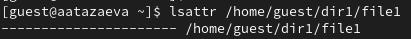{#fig:001 width=70%}

2. Установили права для файла, разрешающие чтение и запись для владельца файла, командой **chmod 600 file1** (рис. 2).

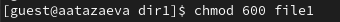{#fig:002 width=70%}

3. Попробовали установить на файл /home/guest/dir1/file1 расширенный атрибут а от имени пользователя guest **chattr +a /home/guest/dir1/file1**. Было отказано в доступе (рис. 3).

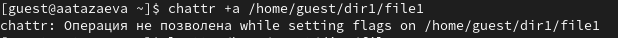{#fig:003 width=70%}

4. От суперпользователя установили расширенный атрибут а командой **chattr +a /home/guest/dir1/file1** (рис. 4).

{#fig:004 width=70%}

5. От пользователя guest проверили правильность установления атрибута командой **lsattr /home/guest/dir1/file1** (рис. 5).

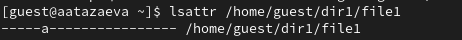{#fig:005 width=70%}

6. Выполнили дозапись в file1, после чего проверили, выполнив чтение файла (рис. 6).

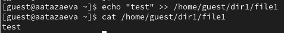{#fig:006 width=70%}

7. Попробовали стереть имеющуюся в файле информацию командой **echo "abcd" > /home/guest/dir1/file1** (рис. 7). Было отказано в доступе. Также пробовали удалить файл (рис. 8) - "операция не позволена". При попытке переименовать файл (рис. 9) получили отказ.

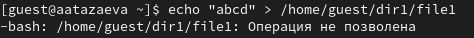{#fig:007 width=70%}
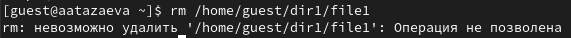{#fig:008 width=70%}
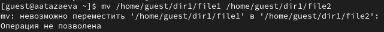{#fig:009 width=70%}

8. Попробовали установить на файл file1 права, запрещающие чтени и запись для владельца файла, успешно выполнить команду **chmod 000 file1** не удалось, также было отказано в доступе (рис. 10).

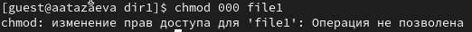{#fig:010 width=70%}

9. Сняли расширенный атрибут а с файла /home/guest/dir1/file1 от имени суперпользователя (рис. 11). Проверили операции, которые не удавалось выполнить ранее (рис. 12). Изменение/Чтение/Переименование/Изменение прав стали доступны.

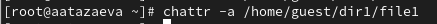{#fig:011 width=70%}
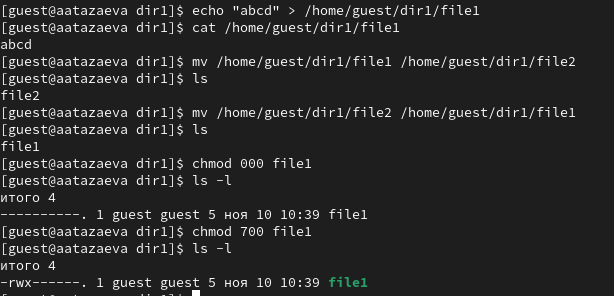{#fig:012 width=70%}

10. Повторили 9 пункт, сняв расширенный атрибут а и добавив расширенный атрибут i (рис. 13). Изменение файла не было ползволено, чтение разрешено, переименование запрещено, изменение прав не позволено.

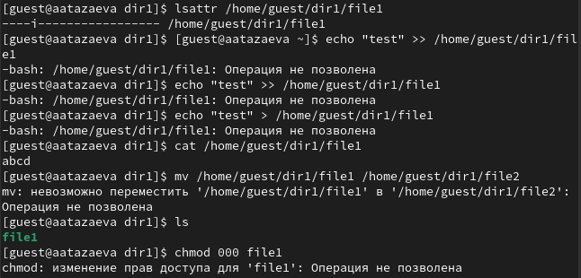{#fig:013 width=70%}

# Выводы

В результате выполнения этой лабораторной работы мною были получены практические навыки работы в консоли с расширенными атрибутами файлов.

