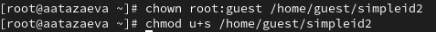

---
## Front matter
title: "Лабораторная работа №5"
subtitle: "Дискреционное разграничение прав в Linux. Исследование влияния дополнительных атрибутов"
author: "Тазаева Анастасия Анатольевна"

## Generic otions
lang: ru-RU
toc-title: "Содержание"

## Bibliography
bibliography: bib/cite.bib
csl: pandoc/csl/gost-r-7-0-5-2008-numeric.csl

## Pdf output format
toc: true # Table of contents
toc-depth: 2
lof: true # List of figures
lot: true # List of tables
fontsize: 12pt
linestretch: 1.5
papersize: a4
documentclass: scrreprt
## I18n polyglossia
polyglossia-lang:
  name: russian
  options:
	- spelling=modern
	- babelshorthands=true
polyglossia-otherlangs:
  name: english
## I18n babel
babel-lang: russian
babel-otherlangs: english
## Fonts
mainfont: IBM Plex Serif
romanfont: IBM Plex Serif
sansfont: IBM Plex Sans
monofont: IBM Plex Mono
mathfont: STIX Two Math
mainfontoptions: Ligatures=Common,Ligatures=TeX,Scale=0.94
romanfontoptions: Ligatures=Common,Ligatures=TeX,Scale=0.94
sansfontoptions: Ligatures=Common,Ligatures=TeX,Scale=MatchLowercase,Scale=0.94
monofontoptions: Scale=MatchLowercase,Scale=0.94,FakeStretch=0.9
mathfontoptions:
## Biblatex
biblatex: true
biblio-style: "gost-numeric"
biblatexoptions:
  - parentracker=true
  - backend=biber
  - hyperref=auto
  - language=auto
  - autolang=other*
  - citestyle=gost-numeric
## Pandoc-crossref LaTeX customization
figureTitle: "Рис."
tableTitle: "Таблица"
listingTitle: "Листинг"
lofTitle: "Список иллюстраций"
lotTitle: "Список таблиц"
lolTitle: "Листинги"
## Misc options
indent: true
header-includes:
  - \usepackage{indentfirst}
  - \usepackage{float} # keep figures where there are in the text
  - \floatplacement{figure}{H} # keep figures where there are in the text
---

# Цель работы

Изучение механизмов изменения идентификаторов, применения SetUID- и Sticky-битов. Получение практических навыков работы в консоли с дополнительными атрибутами. Рассмотрение работы механизма смены идентификатора процессов пользователей, а также влияние бита Sticky на запись и удаление файлов.

# Выполнение лабораторной работы

## Создание программы

1. Вошла в систему от имени пользователя guest.

2. Создала программу simpleid.c (рис. 1).

{#fig:001 width=70%}

3. Скомпилировала программу (рис. 2).

{#fig:002 width=70%}

4. Выполнила программу (рис. 3).

{#fig:003 width=70%}

5. Выполнила системную программу id (рис. 4), значения выполнения программы simpleid и системной программы id совпадают.

{#fig:004 width=70%}

6. Перезаписала прошлую программу, усложнив её (рис. 5).

{#fig:005 width=70%}

7. Скомпилировала и запустила simpleid2.c (рис. 6).

{#fig:006 width=70%}

8. От имени суперпользователя выполнила команды (рис. 7).

{#fig:007 width=70%}

9. Команда **chown root:guest simpleid2** устанавливает root-а владельцем файла, а также устанавливает группу guest владельцем этого же файла. Второй командой изменили права.

10. Выполнила проверку правильности установки новых атрибутов и смены владельца файла  (рис. 8).

{#fig:008 width=70%}

11. Запустила simpleid2 и id, результаты свпадают (рис. 9).

{#fig:009 width=70%}

12. Проделала пункты 8-11 относительно SetGID-бита, сначала изменив права (рис. 10), далее выполнив программу и сверив с id (рис. 11).

{#fig:010 width=70%}
{#fig:011 width=70%}

13. Создала программу readfile.c (рис. 12).

{#fig:012 width=70%}

14. Скомпилировала её (рис. 13).

{#fig:013 width=70%}

15. Сменила владельца и изменила права у файла readfile.c (рис. 15).

{#fig:014 width=70%}

16. Пользователь guest не может прочитать файл readfile.c (рис. 15).

{#fig:016 width=70%}

17. Сменила владельца и изменила права у программы readfile (рис. 17).

{#fig:017 width=70%}

18. Чтение файла readfile.c с помощью программы readfile (рис. 17).

{#fig:018 width=70%}

19. Чтение файла /etc/shadow с помощью программы readfile (рис. 18).

{#fig:019 width=70%}

## Исследование Sticky-бита

1. Создали файл /tmp/file01.txt, изменили его, записав в него некоторый текст (рис. 19). Просмотрели атрибуты у только что созданного файла (рис. 20) и выдали разрешение на чтение и запись для категории пользователей "остальные".

{#fig:020 width=70%}
{#fig:021 width=70%}

2. От пользователя guest2 попробовали прочитать новый файл(рис. 21), дозаписать в него текст (не удалось)(рис. 22), записать другой текст вместо имеющегося (не удалось)(рис. 23), удалить файл- также не удалось(рис. 24).

{#fig:022 width=70%}
{#fig:023 width=70%}
{#fig:024 width=70%}
{#fig:025 width=70%}

3. Повысили права пользователя и сняли атрибут t(рис. 25).

{#fig:026 width=70%}

4. Проверили атрибут у директории /tmp и проверили шаг 2(рис. 26), удалось только удалить файл.

{#fig:027 width=70%}

5. Вернули атрибут t(рис. 27).

{#fig:028 width=70%}

# Выводы

Изучила механизм изменения идентификаторов, применения SetUID- и Sticky-битов. Получила практические навыки работы в консоли с дополнительными атрибутами. Рассмотрела работу механизма смены идентификатора процессов пользователей, а также влияние бита Sticky на запись и удаление файлов.

