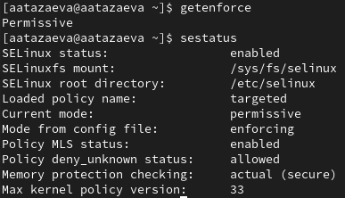
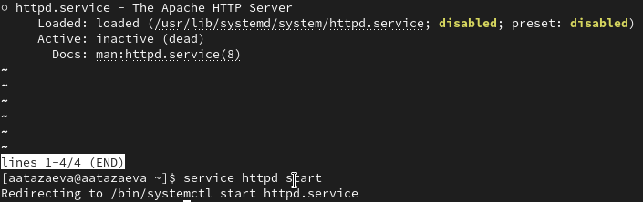
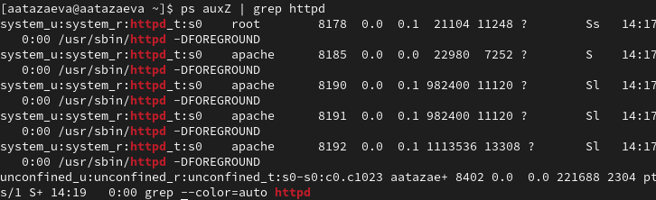
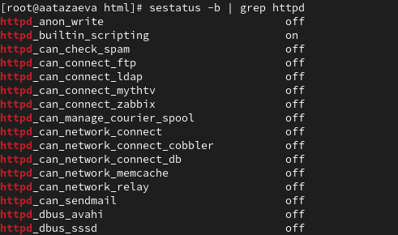
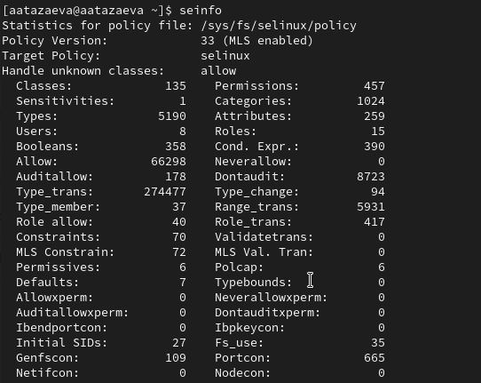
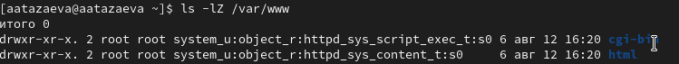
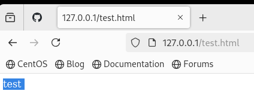
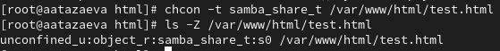
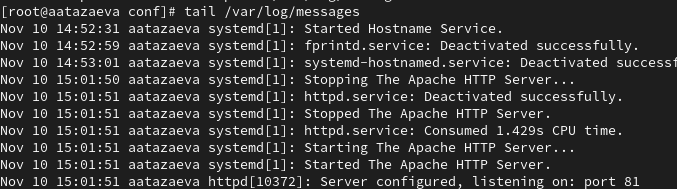
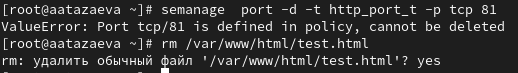

---
## Front matter
title: "Лабораторная работа №6"
subtitle: "Мандатное разграничение прав в Linux"
author: "Тазаева Анастасия Анатольевна"

## Generic otions
lang: ru-RU
toc-title: "Содержание"

## Bibliography
bibliography: bib/cite.bib
csl: pandoc/csl/gost-r-7-0-5-2008-numeric.csl

## Pdf output format
toc: true # Table of contents
toc-depth: 2
lof: true # List of figures
lot: true # List of tables
fontsize: 12pt
linestretch: 1.5
papersize: a4
documentclass: scrreprt
## I18n polyglossia
polyglossia-lang:
  name: russian
  options:
	- spelling=modern
	- babelshorthands=true
polyglossia-otherlangs:
  name: english
## I18n babel
babel-lang: russian
babel-otherlangs: english
## Fonts
mainfont: IBM Plex Serif
romanfont: IBM Plex Serif
sansfont: IBM Plex Sans
monofont: IBM Plex Mono
mathfont: STIX Two Math
mainfontoptions: Ligatures=Common,Ligatures=TeX,Scale=0.94
romanfontoptions: Ligatures=Common,Ligatures=TeX,Scale=0.94
sansfontoptions: Ligatures=Common,Ligatures=TeX,Scale=MatchLowercase,Scale=0.94
monofontoptions: Scale=MatchLowercase,Scale=0.94,FakeStretch=0.9
mathfontoptions:
## Biblatex
biblatex: true
biblio-style: "gost-numeric"
biblatexoptions:
  - parentracker=true
  - backend=biber
  - hyperref=auto
  - language=auto
  - autolang=other*
  - citestyle=gost-numeric
## Pandoc-crossref LaTeX customization
figureTitle: "Рис."
tableTitle: "Таблица"
listingTitle: "Листинг"
lofTitle: "Список иллюстраций"
lotTitle: "Список таблиц"
lolTitle: "Листинги"
## Misc options
indent: true
header-includes:
  - \usepackage{indentfirst}
  - \usepackage{float} # keep figures where there are in the text
  - \floatplacement{figure}{H} # keep figures where there are in the text
---

# Цель работы

Развить навыки администрирования ОС Linux. Получить первое практическое знакомство с технологией SELinux. Проверить работу SELinux на практике совместно с веб-сервером Apache.

# Выполнение лабораторной работы

## Создание программы

1. Вошла в систему с полученными учётными данными и убедилась, что
SELinux работает в режиме enforcing политики targeted с помощью команд getenforce и sestatus (рис. 1). Запустила веб-сервис Apache (рис. 2).

{#fig:001 width=70%}
{#fig:002 width=70%}

2. Определила его контест безопасности (рис. 3). Посмотрела текущее состояние переключателей SELinux (рис. 4).

{#fig:004 width=70%}
{#fig:004 width=70%}

3. Посмотрела статистику по политике с помощью команды seinfo (рис. 5).

{#fig:005 width=70%}

4. Определила тип файлов и поддиректорий, находящихся в директории /var/www, обратилась к файлу через веб-сервер (рис. 6 и рис. 7)

{#fig:006 width=70%}

{#fig:007 width=70%}

5. Изменила контекст файла /var/www/html/test.html с httpd_sys_content_t на любой другой (рис. 8), к которому процесс httpd не
должен иметь доступа, попробовала ещё раз получить доступ к файлу через веб-сервер, интересно, что у меня доступ был разрешен и я всё также видела запись "тест". Предположить не могла как исправить это и потому часть пунктов опускаю в лабораторной работе.

{#fig:008 width=70%}

6. Просмотрела log-файлы веб-сервера Apache (рис. 9).

{#fig:009 width=70%}

7. Не удалось открыть файл через 81 порт, так что контекст был возвращен и привязка к порту 81 была удалена, также был удален файл html (рис. 10)

{#fig:010 width=70%}

# Выводы

Я развила навыки администрирования ОС Linux. Получила первое практическое знакомство с технологией SELinux, а также проверила работу SELinux на практике совместно с веб-сервером Apache.

